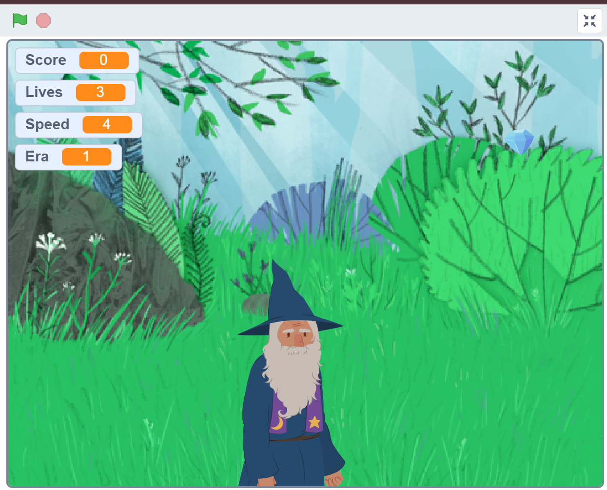

# ⏳ Time Weaver

Time Weaver is a Scratch game created as part of **Harvard University's CS50: Introduction to Computer Science** (Problem Set 0).

Players control a wizard who must catch falling crystals, avoid flying bats, and collect bonus stars while traveling through different eras. As the score increases, the game becomes more challenging with faster gameplay and changing environments.

---

## 🎮 Gameplay

- Move the wizard using the **Left** and **Right Arrow** keys.
- Catch **Crystals** to earn points.
- Collect **Stars** for bonus points.
- Avoid **Bats**, which reduce your lives.
- Progress through different eras as your score increases.
- Restore the timeline before you run out of lives.

---

## ✨ Features

- Interactive gameplay
- Score and lives tracking
- Increasing difficulty
- Multiple backdrops (eras)
- Custom Scratch block with input
- Loops and conditional logic
- Keyboard controls

---

## 🛠 Technologies Used

- Scratch
- Harvard CS50

---

## 📸 Gameplay Preview

---

## 👩‍💻 Author

**Ruchita Vadile**
